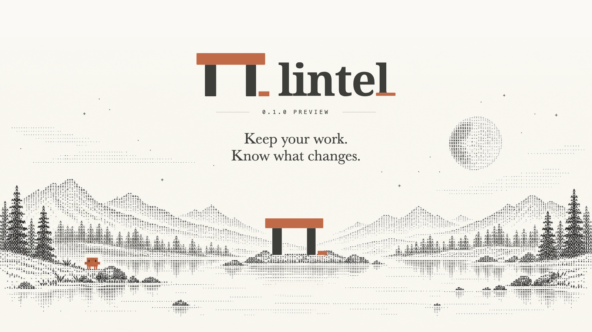

# Lintel

[中文](README.md) · English



A clean, personal tool for Claude Code users. Review configuration changes,
preserve selected instructions, memories and sessions, and check operation results.
The macOS app and standalone CLI share the same execution core.

**Lintel 0.1.0 Preview / development preview. The source is public; you can try
it from source in an isolated test environment. There is currently no public
Release download and no signed or notarized distribution.** The full SPEC is
not delivered. Limited local cleanup, the official logout entry, work
archive/migration and SSH control are wired up. Real authentication, production
Chrome/Edge/Firefox/AdsPower, OS-level network enforcement, and production
remote environments remain unverified. See
[current state](docs/current-state.md) for the current candidate source and
layered evidence. Public source is not a general reuse licence; a licence for
the original materials is still to be chosen.

## First trial: get the source, then one guided journey

You can try the real CLI today from public source. There is no public Release
download. Get it and build it:

```sh
git clone https://github.com/IndelibleVivi/lintel-cc.git
cd lintel-cc
cargo build -p lintel-runner
```

Then follow the **[English quickstart](docs/quickstart.en.md)** (or the
[Chinese quickstart](docs/quickstart.md)). In one disposable synthetic
home/state it registers an environment, previews an exact selection, reviews
and approves a frozen archive-only plan, queries the original job, and
re-inspects/reads the carried `.age` package in a **separate independent
state** — without touching your real Claude login, settings or browser data.

## Three core values

1. **Preserve selected work.** Generate an encrypted archive only, or archive
   and then prepare a new config root and migrate the content you select. The
   independent `.age` package can be read and selectively imported without the
   original job or state. Content is kept as data: no claim that a conversation
   can be resumed.
2. **Review changes.** Preview the exact settings changes before approving
   them, then read back the result. Seven recognized controls can be kept,
   disabled or removed per field, with current value, source, impact and
   restoration shown. Reading configuration is separate from what actually
   runs.
3. **Check original results.** Build a frozen, hashed plan, review it, approve
   the exact hash, and query the original job afterwards. Interrupted work is
   checked by querying the original ID (query-only, never auto-replayed or
   auto-recovered). Field restore detects later external edits.

## Start from the goal in front of you

| What you want | Current entry | How-to |
| --- | --- | --- |
| Send less data out while keeping the features you need | Protect plan | [Choose a plan and check the result](docs/operator-guide.md#protect) |
| Collect instructions, memory and sessions, or prepare a new environment | Work preservation | [Archive-only, preserve and portable work](docs/operator-guide.md#work) |
| Fix login, clean client state, or retire an environment | Cleanup and rebuild | [Exact scope and preserve-first order](docs/operator-guide.md#cleanup) |
| Manage a specific browser profile | Browser on the home screen | [Load, pair and two-phase clear](docs/browser.md) |
| Manage SSH hosts and explicitly bound services | Hosts and SSH | [Connect, query original jobs and services](docs/remote.md) |
| Check for changes, restore settings or recover an interrupted result | Records and recovery | [Original-job query and conflict handling](docs/operator-guide.md#recovery) |

For a first run, start with the [English quickstart](docs/quickstart.en.md);
the [human operator guide](docs/operator-guide.md) (in Chinese) covers the GUI
workflow task by task. The sidebar "Terminal and Agent" lets you choose the
exact CLI, check HOME/state and execution user, and review and copy the current
task's operation handoff. The [Agent CLI guide](docs/agents.md) covers obtaining
a candidate, installing it independently, and automation. The home screen, help
and `lintel tasks --json` share one
[six-task map](contracts/task-catalog.json).

A browser clear started from the App can continue from a popup after a full
browser restart, and the final result returns to the original App task. An
unexecuted preview can be cancelled or expires after five minutes; retrying
requires a new preview and approval, and old IDs are never redone.

## What you can do today

- Register a Claude Code config directory, or create a dedicated environment.
  Select the environment at the top, open the protect plan, preview the exact
  changes, then approve execution.
- Choose "keep features", "reduce egress" or "custom". Custom lets you keep,
  disable or remove each of seven recognized controls, showing current value,
  source, impact and how to restore; other settings, general proxy and custom
  OTel are preserved. Installed versions are identified statically.
- View durable task results, check for settings drift, accept the current
  values, and restore Lintel's field changes from its own records. After an
  interruption, querying the original job checks the concrete settings
  publication evidence before an independent restore preview is offered;
  later conflicting edits block restore.
- Work preservation can archive only, or archive and prepare a new config root
  and migrate the selected content. Both report completion against their own
  goal; the old directory, login and settings are preserved. An independent
  `.age` package remains readable off the original job/state.
- Before preserving, select by whole category, by project path group, session
  file group, or individual file. Oversized sessions can be explicitly
  excluded while other items are fully preserved. A frozen plan also has a
  16 MiB persisted-record budget; deep paths and many destinations can be
  rejected while still within the body limits, in which case narrow the exact
  selection. The paged file inventory reads metadata only.
- Environment details show connected components by exact host/root: limited
  CLI, config sources, auth location metadata, original service records and an
  independent browser entry. A read-only capacity preflight flags over-limit
  files and scan gaps; the real plan still re-reads all selected originals.
- Unlock an archive in the current task or an independent work package on a
  target host, page through messages, tools and unknown records, generate an
  editable handoff draft, and separately create an import plan. The approval
  view and CLI show each selected file's source, final destination and digest.
  Import never overwrites a same-name file.
- Open the selected config environment in an independent project cwd. Launch
  and resume previews list limited roots, project/ancestor candidates and
  system managed config sources, and flag hooks/MCP/helper declarations and
  unknown auth. They do not execute config content or read credential bodies,
  and do not prove actual loading or isolation. Native resume is a separate
  approved finite entry using a byte-identical private transcript copy.
- The default home screen is a quiet Clawd companion, with original time-of-day
  greetings; an explicit action opens six task choices. Day / Night / System
  themes are available. The pocket playroom shares one opt-in runner with the
  website: Clawd keeps its connected short legs, bounces over obstacles, and
  collects stars at different reachable heights. Scores stay local to each client.
- Optionally start a loopback proxy in the desktop environment detail, set a
  default allow/block and exact host/port rules, read back the live config, and
  explicitly request opening Claude through that channel. Only connections
  through the proxy are covered.
- From the home screen "Browser" entry, prepare the companion extension,
  install the local connection, pair and view instances. The App ships
  Chromium/Firefox extension and Native Messaging host. The extension still
  needs a developer load; signed/store distribution is not done. Site clear is
  two-phase: isolated preparation, a full browser restart, then a separate
  confirm to delete.
- Register, remove and undo removal of an SSH alias on the desktop, reusing the
  same environment, cleanup, archive and task views. Removing an alias affects
  only Lintel's host list; system SSH config and original tasks are retained.
  Linux x86_64/arm64 hosts can "check and prepare the runner" from the host
  panel: preview, then approve installing the App's built-in static runner.
  Only the target user's dedicated version directory is written; no compiler or
  sudo is needed on the VPS.

See the [operator guide](docs/operator-guide.md) for the human workflow and
[remote](docs/remote.md), [browser](docs/browser.md) and [services](docs/services.md)
for the specific limitations.

## Local build and trial

Requires Rust stable, Node.js and npm; the macOS desktop build also needs Xcode
Command Line Tools. The current local build and test host is macOS arm64. Linux
source has passed synthetic journeys, independent OpenSSH and real
systemd/PAM/reboot VM checks in Ubuntu CI; see the
[verification guide](docs/verification.md). Real authentication and production
VPS are verified separately.

```sh
cargo build --workspace
cd apps/desktop
npm ci
npm run dev:synthetic
```

Open the local address the dev server prints. `dev:synthetic` creates an
isolated temporary home/state and calls the real CLI; the interface clearly
labels it a "test space" and never uses your Claude login or browser data. The
generated temporary directory is retained for inspection. Plain `npm run dev`
does not provide a browser-to-host execution channel.

Standalone CLI (run these from the repository root):

```sh
./target/debug/lintel version --json          # static; no state, no discovery
./target/debug/lintel context --json          # read-only state/user/exe facts
./target/debug/lintel tasks --json            # static; the six-task map
./target/debug/lintel work --help             # static help; no state
./target/debug/lintel capabilities --json     # static catalog; optional target inspection
./target/debug/lintel describe plan_policy    # static operation contract
./target/debug/lintel env list                # may register discovered roots + save inventory
./target/debug/lintel tui                      # interactive; uses real state
```

`version`, `context`, `tasks`, `help`, `describe`, `schema`, and `capabilities`
without a target are **static**: they do not run Claude, discover personal directories, or
initialize state. `env list` and `tui` are different — `env list` may register
discovered default roots and save inventory, and `tui` operates on real state,
so do not run them against your real HOME just to read help.

Named commands or the compatible `lintel request` share plan / approval /
execute / query / recovery. **Rejected submissions exit non-zero; an accepted
ACK is not task completion.** Interactive start uses `lintel launch ID` on a
real TTY; generic `call launch` is explicitly refused.

Independent CLI candidates can be packaged for macOS arm64 and Linux
x86_64/aarch64, each carrying both static Linux remote runners, candidate
identity and a file checksum manifest. There is no formal download link. See
[obtaining and installing a candidate](docs/agents.md#用户安装候选包).

## Data and boundaries

No Lintel account, model key or license key is needed. The app sends no
analytics, crash uploads or remote font requests by default; there is no online
activation service. The browser host and core each expose only their own
limited operations, with no arbitrary shell/file interface. Data is previewed
locally and copied manually; there is no automatic upload.

Config-directory isolation is not an OS sandbox and does not prove login
credentials are independent. Proxy environment variables are not OS-level
process network enforcement. Browser deletion cannot be undone; settings
restore checks current values. Lintel does not promise to change server-side
account state.

## Feedback and issues

Use the project's GitHub Issues for bug reports and questions:
<https://github.com/IndelibleVivi/lintel-cc/issues>. For a first-trial
roadblock, the [Preview feedback template](.github/ISSUE_TEMPLATE/preview-feedback.yml)
asks for source revision, platform, and steps. Attach only synthetic or
redacted information; **never** attach credentials, tokens, raw conversations,
work packages, personal browser data, an unredacted Lintel state export, or
private paths.

## Development and documentation

The standalone static website source is in [`apps/site`](apps/site/README.md).
It explains the six current tasks and uses a synthetic preservation journey to
show preview, approved execution, and original-job verification. The spacious character
landscape uses the native wordmark with a full orange final-l foot and a separate
slow-blinking header underscore. Lake taps make ripples that expand, fade and
expire; the three Clawds have quiet, temporary visual responses, with no discovery
counter or coaching prompts. Night scenery uses soft warm-gray tones while keeping
the original orange bodies and dark eyes. A hidden star map remains in the scenery.
An interactive four-step work-package journey explains the
flow; scenery can be paused and respects reduced motion. Source-reading examples,
Chinese and English trial links, and the opt-in Clawd game remain available.
A quiet link opens the 20-second English concept film with speech, music and sound
effects; playback starts only on request. The complete static site is available in
a Cloudflare Pages preview; the production domain is pending activation. It does
not connect to the local execution core. See the
[site README](apps/site/README.md) to start it.

```sh
python3 tests/verify.py
python3 tests/verify.py --list
python3 tests/verify.py --json /tmp/lintel-verify/evidence.json
```

- [Product target](docs/SPEC.md), [this round's product baseline and 18 behavior checks](docs/specs/product-baseline-status.md), [86 full acceptance checks](docs/ACCEPTANCE.md)
- [Unified verification and independent runtime gates](docs/verification.md)
- [Current implementation state](docs/current-state.md), [desktop usage and visual conventions](docs/desktop.md), [visual identity and source assets](docs/visual-language.md)
- [Human operator guide](docs/operator-guide.md), [Agent CLI and installation](docs/agents.md)
- [Shared core / CLI](docs/core.md), [browser](docs/browser.md), [network](docs/network.md), [remote](docs/remote.md), [Linux service pause/resume](docs/services.md)
- [Current implementation architecture](docs/architecture.md), [protocol](contracts/protocol.md), [research basis](docs/RESEARCH.md)

### Source layout

`crates/core` owns plans and file operations, `apps/runner` provides the CLI,
`apps/desktop` is Tauri + React, `extensions/browser` holds the extension and
Native Messaging host, `crates/egress` is the controlled proxy,
`crates/operations` owns static operation schemas and strict field contracts,
`crates/remote` is the shared limited SSH controller for GUI and CLI, and the
desktop `src-tauri/src/remote.rs` only locates App resources and adapts native
commands.

## Platform support

- **macOS desktop GUI**: Tauri app, currently built and checked as an unsigned
  arm64 candidate.
- **macOS arm64 CLI** and **Linux headless CLI** (x86_64 / aarch64): standalone
  CLI; Linux source is built and checked synthetically.
- Three-platform candidate package records exist, but that does not mean they
  are downloadable or that the Linux runtime fully passes. Only source code is
  public.

## Source, licensing and rights

Lintel is an independent tool, not affiliated with Anthropic. The Clawd
character belongs to Anthropic; the optional local font is not distributed
with the repository. Product name **Lintel**, repository currently named
**lintel-cc**. Source is available at
<https://github.com/IndelibleVivi/lintel-cc>. Only the **source code is
public**; a general reuse licence for the project's original code,
documentation and identity assets has not yet been chosen, and source
visibility does not grant a general reuse licence. Third-party dependencies
and the Clawd character retain their own rights.
