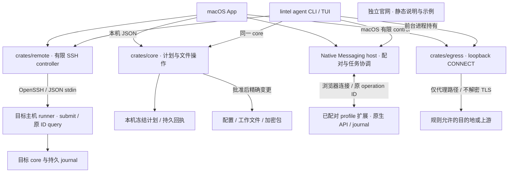

# 执行权威与状态

本图说明当前源码的调用与执行归属；它不代表所有平台或完整旅程已验收。运行证据与候选状态见 [当前状态](current-state.md)，完整目标仍由 [SPEC](SPEC.md) 保留。

[查看可编辑 SVG 图](assets/architecture.svg)。SVG 使用暖纸上的本机／目标主机执行区与独立通道；下方 Mermaid 和本文拥有语义，SVG 保持相同执行归属，不单独定义能力。SVG 适合约 900 px 以上宽度阅读；小窗口可直接读下面的说明。

`crates/operations` 提供静态 core operation/schema 与 named/finite transport 的严格字段合同；它不执行副作用。App 与 CLI 的本机文件操作、冻结计划和恢复都由 core 拥有。SSH controller 只运输有限请求并保存原任务映射；目标 runner/core 持久接受后才 ACK，重连只查原 ID。清理按状态备份／工作归档 → 新根迁入 → 批准的注销／文件处理推进。

浏览器 host 负责配对和任务协调，扩展负责 profile 的权限、原生操作与执行 journal；真正 browser startup 和另行批准才允许完成 clear。macOS CLI 包含 host control，Linux runner 明确返回组件不可用。App 与 CLI 分别持有自己的网络通道，代理只证明经过它的连接，不能证明进程直接出站被强制阻止。

portable work 的密文文件可通过用户明确选定的系统传输工具交接；目标 core 可独立检查与迁入，不依赖源 inventory/job。文件传输本身不属于 SSH controller 的隐式任务。
官网没有通向 core、host、SSH controller 或代理的执行路径；它只展示本地插画、合成阅读示例与共享 Clawd 游戏；阅读示例不构成真实操作或任务回执。
关键状态为 `planned → accepted → executing → verifying → completed / partially_completed / failed / needs_reconciliation`。`accepted` 只在 journal 可持久查询后成立。不确定的副作用查询原任务，不重放破坏性动作；恢复以字段归属与当前值为依据。
