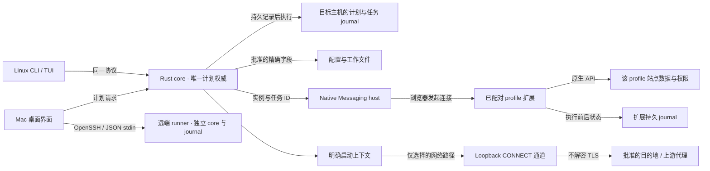

# 执行权威与状态

本图是 SPEC 的目标架构。具体已接通与未验收部分见 [当前状态](current-state.md)，图中组件存在不代表整条旅程已通过。

界面持有草案与展示状态，目标 core 拥有计划与文件操作授权；浏览器扩展拥有原生浏览器操作结果。SSH 连接状态与业务任务状态分别保存。网络通道只证明经过它的连接；进程直接出站约束是独立的平台能力。

关键状态为 `planned → accepted → executing → verifying → completed / partially_completed / failed / needs_reconciliation`。`accepted` 只在 journal 可持久查询后成立。不确定的副作用查询原任务，不重放破坏性动作；恢复以字段归属与当前值为依据。
