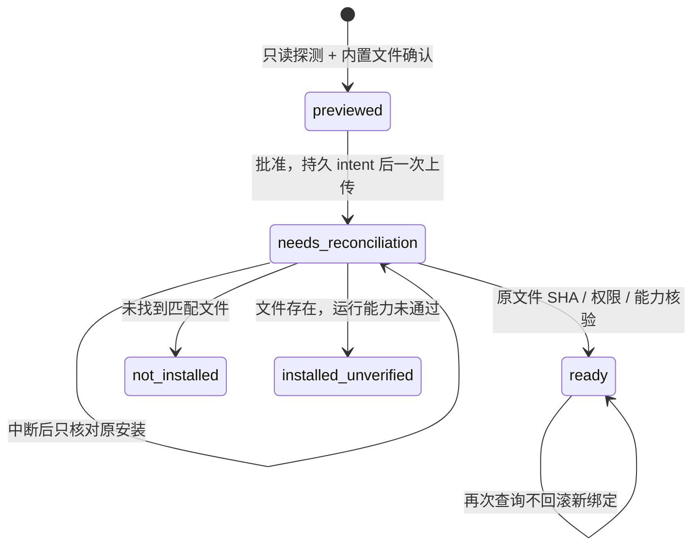

# SSH 远程控制与断线核对

桌面应用通过 Rust native `remote_request` bridge 使用系统 OpenSSH，**不要求管理端安装 Python**。远端需要独立的 Rust `lintel` runner 和用户已有的 OpenSSH 服务；无需 Node 或桌面 runtime。私钥仍由用户的 OpenSSH 配置和系统 agent 管理，Lintel 不复制私钥或创建公网管理端口。

`platform/ssh/lintel_ssh.py` 保留为可选的 Python 3.10+、stdlib-only 命令行 controller。它有独立 CLI 调用者；桌面不会启动或依赖该脚本。两个入口都只发送有限操作。桌面另有固定的安装条件探测、上传和核验脚本；不接受前端传入命令、URL、二进制路径或脚本。

## 连接前的准备与主机登记

远端需要可运行的 `lintel`。已有非交互 PATH runner 可直接连接；Linux x86_64 / arm64 也可使用下述 App 内置 runner 安装。登记与“连接”本身不会安装软件，安装始终需要单独的具体预览与批准。内置二进制为开发候选，SHA-256 核验的是 App 内文件与上传结果一致，不等于正式签名或发行来源认证。

桌面可以读取当前用户 SSH config 中的 literal `Host` aliases，也可以手工添加 alias。导入过程仅静态读取当前文件：不执行 `ssh -G`、`Match exec`、ProxyCommand，不展开 `Include` 或 Host 通配符。结果列出被忽略的 directive 类型，不能据此声称枚举了全部 SSH hosts。只有字母数字开头、包含字母数字与 `.`, `_`, `-`、最多 128 字节的 literal alias 才能登记；不接受 `user@host`、选项、空格或 shell 语法。真正连接时，OpenSSH 按用户选择的 alias 和已有配置解析 HostName / IdentityFile / Include 等，但本机命令执行被固定关闭：`ProxyCommand=none`、`RemoteCommand=none`、`PermitLocalCommand=no`，配置中的这些本机命令不会运行。唯一例外是用户 config 中的 `Match exec` 判定命令：OpenSSH 没有“保留配置但跳过 Match exec”的开关，它仍会在解析配置时以本机用户身份执行。这属于用户自有 SSH 配置的既有行为，不是 Lintel 发起的远端命令；不能接受这一点的宿主应先自行清理该 config。

登记只保存 alias，不建立连接。用户显式连接后，由远端 runner 返回环境列表和能力；环境、路径与计划始终属于所选主机。macOS 展示数据不是远端删除依据。生成与执行计划都由远端 core 核验当前目标。

“移除主机”只移除 Lintel 的主机列表登记，不修改系统 SSH config、known_hosts 或远端文件，也不取消已提交的任务。持久任务及去重记录保留；已移除主机的任务仍出现在 `hosts.tasks`，可通过原 `plan_id` 查询。重新添加同一 alias 后，旧计划仍只查询原 job，不能借移除/添加来重新执行。

已有 SSH host key 必须先通过用户正常的可信流程核对。控制端固定设置 `StrictHostKeyChecking=yes` 与 `UpdateHostKeys=no`，不会自动接受首次 key、忽略变化或更新 known_hosts。连接失败后应在用户自己的 SSH 工具中核对主机身份，再从 Lintel 连接；不能改成自动忽略模式。

## 在 App 中准备 Linux 运行器

1. 登记已经由系统 SSH 核验身份的 alias，选择“检查并准备运行器”。固定脚本只读取系统、CPU、UID、home 与 machine-id，检查基础工具和 PATH 中是否已有 runner；不会读取 Claude 文件。
2. 预览显示目标系统、SSH 登录用户、App 内版本、大小和影响范围。展开“安装与校验详情”可查看准确安装位置与 SHA-256。只支持 Linux x86_64 / aarch64（arm64）；缺少基础工具或 machine-id 时返回明确限制。
3. 点击“批准并安装这个运行器”。App 上传本地内置的静态 musl ELF，不下载远端脚本，不在 VPS 上编译；远端不需要 Rust、Node、Python 或 sudo。
4. 文件放入当前 SSH 用户的 `$HOME/.local/share/lintel/runners/<sha256>/lintel`，权限为 700。安装卡直接显示登录用户的 UID（UID 0 显示为 root），runner 的环境发现和管理范围也属于该用户。若 Claude 由另一用户运行，应使用那个用户的 SSH alias；当前用户的非交互 PATH 找不到 Claude，不能证明其他用户也未安装。专用目录须归此用户所有，路径中的符号链接拒绝；同名文件仅在字节和执行权限均匹配时复用，冲突文件保留。PATH、shell rc、sshd、系统服务和 Claude 配置不更改，旧版本保留。
5. SHA-256 与可执行文件核验通过后，调用真实 `discover`，确认 `detached_submission` 能力，才更新 Lintel 的 alias→runner 绑定。然后点击“连接并管理”。隔离 Linux VM 的 logout/cgroup 与重启后原任务核对已通过下述独立检查；完整生产 VPS 操作仍是独立关口，不能承诺退出登录后的任务存活。

主视图显示当前状态与一个主要动作，技术标识放在可展开详情。安装记录跨窗口和 App 重启保留；移除 alias 不删除记录或远端文件。

本地安装 intent 在任何上传前持久化。回包丢失、deadline 或进程中断后，选择“核对原安装”：只探测原目标并核验同一 SHA 的文件，再核验原运行能力，不重新上传。存在未核对的安装时不能生成第二份上传计划。重复 `install_runner` 同样只核对；不能通过再次批准重发上传。明确未安装时可重新生成新预览。已激活记录的再次查询不回滚后来更新的绑定。

新提交记录冻结所用 runner digest；更新绑定后，旧任务仍向原版本查询。以前没有 digest 的记录保留 PATH 查询，以兼容已有调用者。这个兼容路径只服务旧任务；新桌面安装绑定不会修改可选 Python CLI 的 PATH 行为。



### 准备 App 内置资源

构建机器须有对应 Rust target 和能输出静态 Linux ELF 的 linker；跨编译可使用已安装的 [cargo-zigbuild](https://github.com/rust-cross/cargo-zigbuild) 与 Zig。在仓库根目录执行：

```sh
rustup target add x86_64-unknown-linux-musl aarch64-unknown-linux-musl
cargo zigbuild --locked --release -p lintel-runner --bin lintel \
  --target x86_64-unknown-linux-musl --target aarch64-unknown-linux-musl
node apps/desktop/scripts/prepare-remote-runners.mjs
cd apps/desktop
npm run desktop:build
```

packager 要求两种架构文件全部存在，核验 ELF 架构且没有动态加载器，然后生成版本、协议、字节数与 SHA-256 manifest。生成资源被 Git 忽略；Tauri 将其带入 `remote-runners`。从源码构建的 App 若未准备这些资源，本机和已有 PATH runner 仍可使用，但安装入口返回 `bundle_unavailable`。资源存在和静态 ELF 构建成功不能代替真实 Linux 执行证据。

## 从源码准备目标 runner

以下是用户自行准备 runner 的手工流程，**不是应用会自动执行的安装步骤**。先取得并审核要使用的 Lintel 源码版本。Linux 目标应在目标 Linux OS / CPU 架构的环境中构建；也可使用与目标兼容的 Linux 构建机。macOS 上构建出的 `lintel` 不能直接复制到 Linux 执行，macOS arm64 App 构建成功也不能证明 Linux runner 可运行。

目标构建环境需要 Rust stable 与该平台的 linker 等基础构建工具；构建 runner 不需要 Node、Tauri 或 WebKitGTK。在源码仓库根目录执行：

```sh
uname -s
uname -m
rustc -vV
cargo build --locked --release -p lintel-runner --bin lintel
./target/release/lintel --help
```

`uname` 显示目标系统与 CPU 架构，`rustc -vV` 的 `host` 字段显示当前 Rust 工具链平台。这里使用 [runner Cargo manifest](../apps/runner/Cargo.toml) 中的 package `lintel-runner` 和 binary `lintel`。未覆盖 Cargo 的 target 目录或 target triple 时，产物为仓库下的 `target/release/lintel`。`--help` 应能直接运行，标题显示 Lintel 版本，并列出 `request`、`submit`、`discover` 等命令；当前 [CLI 实现](../apps/runner/src/main.rs) **没有 `--version` 参数**。

确认目标用户、构建产物与安装/更新操作后，可以在该目标用户自己的终端中放入用户级 bin 目录。以下复制会安装或替换该用户的同名 `lintel` 文件，不需要 sudo：

```sh
install -d "$HOME/.local/bin"
install -m 755 ./target/release/lintel "$HOME/.local/bin/lintel"
"$HOME/.local/bin/lintel" --help
```

随后确保这个目录属于**该账号的非交互 SSH PATH**。仅在交互终端执行 `export PATH=...` 不足以证明桌面连接能找到它；PATH 的持久配置位置由目标账号的登录 shell 与 sshd 配置决定。不要为修复 PATH 改成关闭主机验证，或在 shell 启动文件向 stdout 打印调试信息。

在管理端自己的终端中，把下例的 `synthetic-host` 换成已核验身份的 alias。第一条检查非交互命令解析出的路径，第二条实际执行该 PATH 中的 runner 帮助。它们不会提交 Lintel 任务，也不会自动接受 host key：

```sh
ssh -T -oBatchMode=yes -oStrictHostKeyChecking=yes -oUpdateHostKeys=no \
  -oPermitLocalCommand=no -oClearAllForwardings=yes -oRequestTTY=no \
  -oConnectTimeout=10 -oServerAliveInterval=15 -oServerAliveCountMax=2 \
  synthetic-host 'command -v lintel'
ssh -T -oBatchMode=yes -oStrictHostKeyChecking=yes -oUpdateHostKeys=no \
  -oPermitLocalCommand=no -oClearAllForwardings=yes -oRequestTTY=no \
  -oConnectTimeout=10 -oServerAliveInterval=15 -oServerAliveCountMax=2 \
  synthetic-host lintel --help
```

若 `command -v lintel` 没有返回路径，先修复该 SSH 会话的 PATH；若返回了非预期程序，核对命令名冲突或旧版本；若路径正确但 `--help` 不能运行，核对执行权限、CPU 架构、文件格式和 Linux 加载器/运行依赖。两项通过后，回到 Lintel 连接该 alias，应用会用真正的 `discover` 请求取得环境与能力。源码构建、用户级安装、非交互 PATH 可见和真实远端任务验收是各自独立的结果。

## 从 App 打开远端会话

连接并选择环境后，在“环境详情 → 启动与来源”或已完成任务回执点击“打开 Claude”。App 先通过 `launch_context` 核对准确环境、退役状态和程序，再打开 macOS Terminal。Terminal 使用固定严格 SSH 选项、同一个 alias 与绑定 runner，分配真实 PTY 并执行 `lintel launch <environment-id>`。环境 ID 先限制字符，再由远端 core 验证 UUID 和登记；程序路径及配置根只在远端解析，远端返回的字符串不放进本机 shell。

runner 按 PATH 优先定位 Claude；找不到时，静态检查当前 SSH 用户官方 native 安装位置 `~/.local/bin/claude`，不加载 shell rc、不扫描其他用户，也不为发现版本而运行 Claude。此路径来自[官方安装说明](https://code.claude.com/docs/en/setup#auto-updates)。目标用户未安装时返回 `executable_missing`，不会自动安装或登录 Claude。

`launch_requested` 仅表示 Terminal 已接受请求；登录和实际会话状态在终端观察。Lintel 不传 prompt、口令或模型请求，不自动重启已有会话。交互会话随 SSH 结束，后台 mutation 仍走 durable `submit` 与原 job 查询。Linux TUI 也提供 `o 打开 Claude`；直接 CLI 使用 `lintel launch <environment-id>`，要求 stdin/stdout TTY、恰好一个环境 ID。它不把本机代理当成远端保护。

## 固定请求与 native API

普通操作使用绑定版本的专用用户路径，尚无绑定时使用 PATH 的 `lintel request`；独立执行使用同一路径的 `submit`，stdin JSON 仍使用 `command: "execute"`。普通请求的环境 ID、路径、approval 和 archive passphrase 都只通过 stdin 传递，不拼进远端命令。协议见 [protocol.md](../contracts/protocol.md)。

JSON 与上传 SSH 同时固定开启 `BatchMode=yes`、`PermitLocalCommand=no`、`ProxyCommand=none`、`RemoteCommand=none`、`ClearAllForwardings=yes`、禁用 TTY，并限制连接建立和存活检查。JSON stdin / stdout 上限为 2 MiB，独立 runner 上传字节上限为 32 MiB；控制端总 deadline 为 60 秒；runner 自己还执行其更窄的请求上限。桌面 native bridge 同时非阻塞读取 stdout / stderr，stderr 超出保留上限后仍排空管道，避免大错误输出阻塞进程。诊断只用于本次本机显示，不写入任务记录。SSH 中断、输出不完整或超限仍返回 `transport_unknown`；runner 的合法 error envelope 即使伴随非零退出也保留原有 code/message，并可附加诊断。没有自动重试执行。

Tauri command 接受 `remote_request({ payload })`，返回单层 Envelope：`{ok:true,data:...}` 或 `{ok:false,error:{code,message,diagnostic?}}`。现有 code/message 保留，新增的 diagnostic 为可选字段。

| `payload.op` | 其他字段 | `data` / 行为 |
| --- | --- | --- |
| `aliases` | 无 | `{aliases, ignored, coverage}`；静态导入，无连接 |
| `hosts` | 无 | `{hosts:[{alias}], tasks:[{alias,plan_id,lookup_id,status,runner_digest?}], installations:[安装记录]}`；恢复本地登记与全部持久任务（含已移除主机），无连接 |
| `add_host` | `alias` | `{alias}`；幂等持久登记，无连接 |
| `remove_host` | `alias` | `{alias,removed:true或false}`；仅移除 Lintel 登记，重复移除返回 false，无连接 |
| `prepare_runner` | `alias` | 只读探测并持久化安装预览，返回 `{install_id,alias,probe,bundle,destination,approval,effects,status}` |
| `install_runner` | `alias`, `install_id`, `approval` | 批准准确预览，重查目标与本地文件；一次上传，核验后绑定。重复调用只核对 |
| `query_install` | `alias`, `install_id` | 核对原安装；已移除 alias 的已有安装也可查询，不上传 |
| `launch` | `alias`, `environment_id` | 只读 launch_context 核对后请求 macOS Terminal：固定严格 SSH＋PTY＋绑定 runner `launch id`，返回 `{status:"launch_requested",message}`；不接受 proxy、prompt、命令或路径 |
| `connect` | `alias` | 远端 `discover` 的 `{environments,capabilities}` |
| `request` | `alias`, `request` | 允许的 core 请求原有 `data`；不再嵌套 Envelope |
| `execute` | `alias`, `plan_id`, `approval`，可选 `archive_passphrase` | 一次 `lintel submit`，返回 durable Receipt；重复调用只查原 job |
| `reconnect` | `alias`, `plan_id` | 通过保存的 lookup ID 查询原 Receipt；已移除主机的已有任务也可查询，从不提交执行 |

连接、安装预览、上传、普通请求和 execute 要求 alias 已登记；reconnect / query_install 对已移除 alias 仅开放本地仍有持久记录的原任务或安装。移除登记不会删除这些记录。普通请求有严格字段 allowlist：

- `discover`、`inspect`、`register`、`create_environment`；
- `plan_policy`、`plan_reset`、`plan_cleanup`、`plan_restore`、`plan_import`；
- `cleanup_inspect`、`auth_probe`、`archive_inspect`、`archive_read`；
- `jobs`、`job`、`drift`、`accept_drift`、`reactivate_environment`、`export_support`。

字段与 core 协议一致；未知字段或任意 shell / generic file 命令被拒绝。`execute` 不能从普通 `request` 绕过持久意图记录。归档内容只在用户明确调用 archive 操作时经响应返回；口令只进入本次请求的 stdin，不进入 SSH argv 或控制端记录。此 bridge 不提供远端 interactive launch、系统 service 管理、通用安装或强约束网络组件操作；相应能力必须由所属模块实现并独立验收。

## 连接错误与本机诊断

只安装 Claude Code 无法满足连接条件：目标上还必须有可从非交互 SSH PATH 调用的 **Lintel runner**。`runner_missing` 会明确提示两者的区别；本工具不因此自动下载或安装程序。

可选 `error.diagnostic` 的结构：

```json
{
  "stage": "ssh",
  "reason": "connection_refused",
  "summary": "目标拒绝 SSH 连接。",
  "next_steps": ["核对 SSH 端口及远端 sshd 是否在监听。"],
  "command": "/usr/bin/ssh -T -oBatchMode=yes -oStrictHostKeyChecking=yes -oUpdateHostKeys=no -oPermitLocalCommand=no -oProxyCommand=none -oRemoteCommand=none -oClearAllForwardings=yes -oRequestTTY=no -oConnectTimeout=10 -oServerAliveInterval=15 -oServerAliveCountMax=2 synthetic-host 'command -v lintel'",
  "exit_code": 255,
  "stderr_excerpt": "ssh: connect to host synthetic.invalid port 22: Connection refused",
  "stderr_truncated": false,
  "submission_uncertain": false
}
```

`stage` 为 `local`、`ssh`、`runner` 或 `response`。`command` 是可复制到管理端终端的只读 SSH 核验命令：使用当前已经校验格式的 alias、相同严格主机检查与 BatchMode/禁转发选项，检查 `command -v lintel`。它不包含 stdin、approval、口令或 `submit`，不会重放原操作；退出码未知时省略 `exit_code`。主要分类如下：

| 阶段 | `reason` | 需要排查的内容 |
| --- | --- | --- |
| local | `ssh_unavailable`、`pipe_error` | 系统 SSH 是否存在、执行权限及本机管道资源 |
| ssh | `dns`、`timeout`、`connection_refused`、`network_unreachable` | HostName、网络/VPN、路由、防火墙、SSH 端口与 sshd |
| ssh | `authentication_failed` | User、IdentityFile、系统 agent；BatchMode 不提供密码对话框 |
| ssh | `host_key_changed`、`host_key_unknown`、`host_key_verification_failed` | 从可信来源核验主机身份；不关闭严格 host key 检查 |
| ssh | `config_invalid`、`ssh_unknown` | SSH 配置错误，或输出不足以确定的其他连接问题 |
| runner | `runner_missing`、`runner_not_executable`、`abnormal_exit` | Lintel runner 的非交互 PATH、权限、架构、加载器、版本和退出码 |
| runner | `runner_rejected` | runner 原有错误 code/message；不会抹去具体请求错误 |
| response | `invalid_json`、`protocol_invalid`、`output_limit`、`deadline` | shell 欢迎输出、协议/版本不匹配、输出上限或请求总等待时限 |

控制端对本地 OpenSSH 设置 C locale，并只按实际收到的错误文本和退出状态分类；不能确认的原因保留为 unknown。`deadline` 只表示整个请求超过控制端等待时限，不断言一定是网络超时。

stderr 最多在内存保留 64 KiB，显示片段最多 4096 字节并按 UTF-8 边界截断，移除 ANSI、终端控制字符和方向控制字符。普通请求的所有 stdin 文本值及 JSON 转义形态会从片段去敏；含 approval 或 archive passphrase 的请求完全省略 stderr 片段，避免截断或变形回显泄露授权值。`stderr_truncated` 表示收集或展示发生截断。片段可能仍包含 SSH 自身输出的本机路径或 SSH 用户名，因此仅在本机查看，不自动持久化或上传。

第一次连接/读取失败会给连接排查建议；提交结果不确定时保留原任务 ID，并提示只查询原 job。查询失败不改变原任务结果，也不会触发重新执行。runner 对原任务查询返回 error Envelope 时，控制端保留 `reconciliation_required`，同时在 message 中保留远端原始 code/message，并继承可用于排查的 diagnostic。`submission_uncertain` 描述本次请求是否涉及尚需核对的 mutation；query 本身为 false 不代表原 job 已成功。

## 持久意图、durable accept 与断线恢复

桌面在 Lintel 用户 state 下的 `remote` 子目录保存 `hosts.json` 和 `tasks/<alias>/<plan-id>.json`。沿用 core 的 `LINTEL_STATE_DIR` override；默认使用平台应用数据目录。目录和记录分别以 `0700` / `0600` 创建，记录原子替换并 fsync 文件与父目录。已存在的目录必须是真实目录（非符号链接）且属主为当前用户，否则拒绝使用。稳定的 lock file 串行化同一 alias / plan 的并发提交。

控制端执行流程：

1. 先持久保存原 `plan_id`、`lookup_id` 与 `submission_unknown`，再启动 SSH。记录不包含 approval、archive passphrase、远端路径、设置或完整 receipt。
2. 每个本地计划记录最多发送一次 `lintel submit`。runner 必须在远端 journal 持久接受后才返回 accepted Receipt，不能仅凭收到 stdin 宣称 accepted。连接的 `discover` capabilities 提供 detached submission 能力说明。
3. 只有有效 Envelope 与匹配 `plan_id`、`id` 的 Receipt 才更新本地观察到的状态。`accepted` 与 `completed` 是不同状态；执行结果仍以远端逐步 journal 为准。
4. ACK 丢失、deadline、SSH 断开、桌面重开或重复点击执行，都转向原 plan/job 的查询。`hosts.tasks` 让桌面重开后仍能显示这些待核对任务。查询不带口令，也不会创建第二份清理。
5. 原 job 不可获得时返回 `reconciliation_required`。查不到记录不能证明副作用没有发生；应核对远端 journal 和目标状态，不要通过删除控制端记录恢复“执行”按钮。后续操作应基于核对结果生成新计划。

本地 intent 持久化不代表远端已 durable accept。提交在发送前就失败时，同样保留保守的查询路径；工具不会为便利假设无副作用。

`lintel submit` 的 detached worker 行为和 journal 由 runner/core 所有。`setsid` 脱离当前 SSH 会话与“机器登录策略允许 worker 长期存活”是不同事实：控制端不启用 linger、不改登录策略、不安装 systemd service，不能承诺所有 VPS 在退出登录后仍允许任务继续。实际 host 的 session/cgroup 或 user-manager 行为仍需按 [G03 / J01–J10](ACCEPTANCE.md) 验证。主机重启、不可逆 action 的不确定结果与恢复冲突由 core 的 journal/reconciliation 处理，不能靠控制端重新提交修复。

## 自定义远端方案

桌面与 Python CLI 的 `plan_policy` 都接受 `preset: "custom"` 及有限的 `custom_settings`，字段与三种 action 见 [core 合同](core.md)。请求只放在 JSON stdin；不是任意 env 写入或 shell 入口。新 App 根据远端 assessment 的 `supported_presets` 判断可用性：旧 runner 的自定义编辑被禁用，需通过批准的运行器准备流程更新并重新检查。已有任务继续使用它们冻结的 runner，不会为了新方案改写原任务版本。Python 也接受 inspect/plan 的用户声明 `trusted_devices` 和 preset 的 `release_settings`，提交仍必须使用准确 plan/hash 与 durable execute。

## 精确暂停远端服务

在“清理与重建”的登录修复、客户端重建或退役配方中，可展开“目标后台服务”，明确选择 user/system manager 与完整 unit 名，再只读检查 root 绑定。检查和预览不停止服务；批准暂停才写入该 unit 的持久启动 blocker、核验实际加载并停止目标。随后清理仍须独立预览和批准。清理检查会拒绝已识别但没有 live hold 的直接绑定服务，手工勾选 stopped 不能替代这一证据。

恢复使用原暂停 job 独立预览、再次批准，只移除原任务拥有的 blocker，并恢复原 active/inactive 状态。外部 unit 编辑冲突会保留修改和 blocker。远端执行仍走 `submit`，丢回包只查原任务。system manager 要求当前 SSH 用户本身是 root；App 不执行 sudo，也不调整 login policy、linger 或其他 supervisor。支持条件与准确 JSON 示例见 [服务操作指南](services.md)。旧 runner 未提供这三个请求时会返回具体限制，需批准更新运行器后重新检查。

## 可选 Python CLI

CLI 保留静态 alias import、普通请求、一次提交与查询。以下只使用 synthetic 标识；实际命令会连接所选 host，必须属于用户已授权的远程操作。

```sh
python3 platform/ssh/lintel_ssh.py aliases --config path/to/synthetic-ssh-config
printf '%s\n' '{"command":"discover"}' | python3 platform/ssh/lintel_ssh.py request synthetic-host
printf '%s\n' '{"command":"plan_policy","environment_id":"00000000-0000-4000-8000-000000000001","preset":"reduce","keep_remote_control":true}' | python3 platform/ssh/lintel_ssh.py request synthetic-host
python3 platform/ssh/lintel_ssh.py execute synthetic-host --plan-id 00000000-0000-4000-8000-000000000002 --approval exact-remote-plan-hash
python3 platform/ssh/lintel_ssh.py reconnect synthetic-host --plan-id 00000000-0000-4000-8000-000000000002
```

Python CLI 保留原有 stderr 丢弃行为；上述结构化连接诊断与移除登记 API 属于桌面 native bridge。CLI 的普通请求提供 `discover`、`inspect`、`plan_policy`、`plan_reset`、`plan_restore`、`service_inspect`、`plan_service_quiesce`、`plan_service_resume`、`jobs`、`job`、`drift`、`export_support`。桌面的附加 cleanup/archive 表单走 Rust native bridge。CLI 的旧默认 state 目录是 `.local/state/lintel/ssh-controller`，可通过 `--state-dir` 指定其他私有目录；它与桌面 state 独立，远端 core 仍以同一 plan/job 标识作为唯一执行权威。

归档执行使用 `--ask-archive-passphrase` 进入不回显终端输入；不要把口令放进参数或 shell history。不能安全关闭回显时，CLI 拒绝提交。实际 plan ID 和 approval 必须使用 runner 返回的值。

```sh
python3 platform/ssh/lintel_ssh.py execute synthetic-host --plan-id 00000000-0000-4000-8000-000000000002 --approval exact-remote-plan-hash --ask-archive-passphrase
```

CLI 的可导入 API 是 `list_aliases(Path)`、`Controller(state_dir).request(alias,payload)`、`.execute(alias,plan_id,approval,archive_passphrase=None)`、`.reconnect(alias,plan_id)`。CLI controller error 转为相同 Envelope；没有安装和自动 replay endpoint。

## 合成验证

```sh
cargo test --manifest-path apps/desktop/src-tauri/Cargo.toml remote::
python3 -m unittest discover -s platform/ssh/tests -v
```

测试仅使用临时 home/state 和 fake SSH executable，不连接真实 host、不读取真实凭据、不改 known_hosts。native 检查 host 持久化、alias 静态扫描、严格 host checking、固定 request/submit argv、stdin 数据隔离、提交意图先于 SSH、并发只提交一次、ACK 丢失后从磁盘恢复查询、缺失 / 错配 receipt 不重放、口令不持久化、超时 / 输出上限，有限 cleanup/archive schema、移除登记后保留未决任务与去重、已移除 alias 的原任务查询、SSH/runner/响应失败分类、stderr 大输出并发排空、ANSI/控制字符清理与请求值去敏、诊断命令仅做 alias 只读核验，以及查询错误保留 runner 诊断且不重放。Python 检查其现有 CLI 路径、归档口令输入、固定 submit 命令与相同的不重放边界。

这些验证证明控制端 transport 与恢复边界，不代表 runner 已部署、真实 VPS session 存活、目标 service 隔离或完整 G03 已完成验收。

`linux-vm-runtime` 是另行明确选择的真实 Linux QEMU guest 检查，使用 inert services 和临时 SSH 用户，实际运行 systemd、PAM logout、cgroup 和 reboot；完整 service suite 后执行 hold 的 prepare/recover。clean `8c9d85c` 的 [CI37177180828](https://github.com/IndelibleVivi/lintel-cc/actions/runs/37177180828) 已完成这套观察：精确 system-manager 服务暂停、邻居保留、外部编辑冲突、独立恢复与真实 reboot 后 loaded hold 通过。`KillUserProcesses=no` 和 `yes` 下 worker 都被实际 logout 终止，原任务查询得到 `needs_reconciliation`；真实 reboot 后同样查询原 accepted job，不重新 execute。它验证了发现中断和保留原任务的行为，未验证退出登录后可靠继续执行。运行条件、镜像与销毁边界见 [统一验证入口](verification.md)。生产 VPS、user-manager 生命周期与完整 G03 仍未验收。
